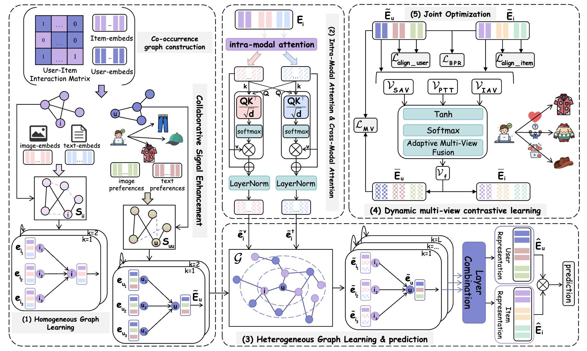

# 🔍 NRDMC: Noise-Robust Item Modeling and Dynamic Multiview Contrastive Learning for Multimodal Recommendation

This repository provides the official implementation of the **NRDMC**:

<p align="center">
   
</p>

## ⚙️ Environment Requirement
- python 3.8
- Pytorch 1.11.0

## 🗂️ Dataset
We provide three processed datasets: Baby, Sports, Clothing.
Download from Google Drive: [Baby/Sports/Clothing](https://drive.google.com/drive/folders/1tU4IxYbLXMkp_DbIOPGvCry16uPvolLk)

## 🔗 Baseline Model Code Link
| Name      | Year | Publication | Code                                           |
| --------- | ---- | ----------- | ---------------------------------------------- |
| VBPR      | 2016 | AAAI        | [code](https://github.com/arogers1/VBPR)       |
| MMGCN     | 2019 | ACM MM      | [code](https://github.com/weiyinwei/MMGCN)     |
| DualGNN   | 2021 | TMM         | [code](https://github.com/wqf321/dualgnn)      |
| BM3       | 2023 | WWW         | [code](https://github.com/enoche/BM3)          |
| FREEDOM   | 2023 | ACM MM      | [code](https://github.com/enoche/FREEDOM)      |
| MGCN      | 2023 | ACM MM      | [code](https://github.com/demonph10/MGCN)      |
| DiffMM    | 2024 | ACM MM      | [code](https://github.com/HKUDS/DiffMM)        |
| LGMRec    | 2024 | AAAI        | [code](https://github.com/georgeguo-cn/LGMRec) |
| EVEN      | 2025 | AAAI        | None                                           |
| NEGCL     | 2025 | KBS         | [code](https://github.com/HubuKG/NEGCL)        |
| MENTOR    | 2025 | AAAI        | [code](https://github.com/Jinfeng-Xu/MENTOR)   |
| MIG-GT    | 2025 | AAAI        | [code](https://github.com/CrawlScript/MIG-GT)  |
| COHESION  | 2025 | SIGIR       | [code](https://github.com/Jinfeng-Xu/COHESION) |
| FastMMRec | 2025 | ACM MM      | None                                           |
| HPMRec    | 2025 | CIKM        | [code](https://github.com/Zheyu-Chen/HPMRec)   |


## ⚙️ training
  ```
  cd preprocessing 
  python build_co_item_user.py -d *
  cd ../src
  python main.py
  ```

## Acknowledgement
The structure of this code is  based on [MMRec](https://github.com/enoche/MMRec). Thank for their work.
